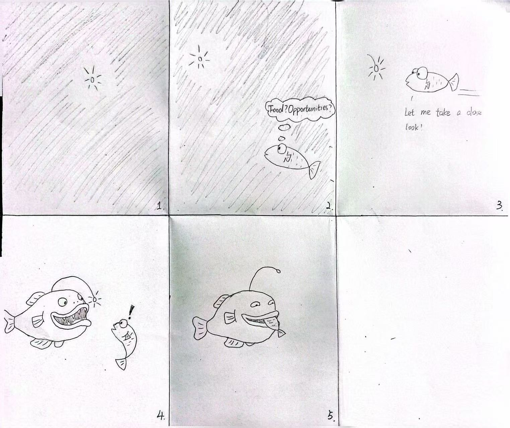
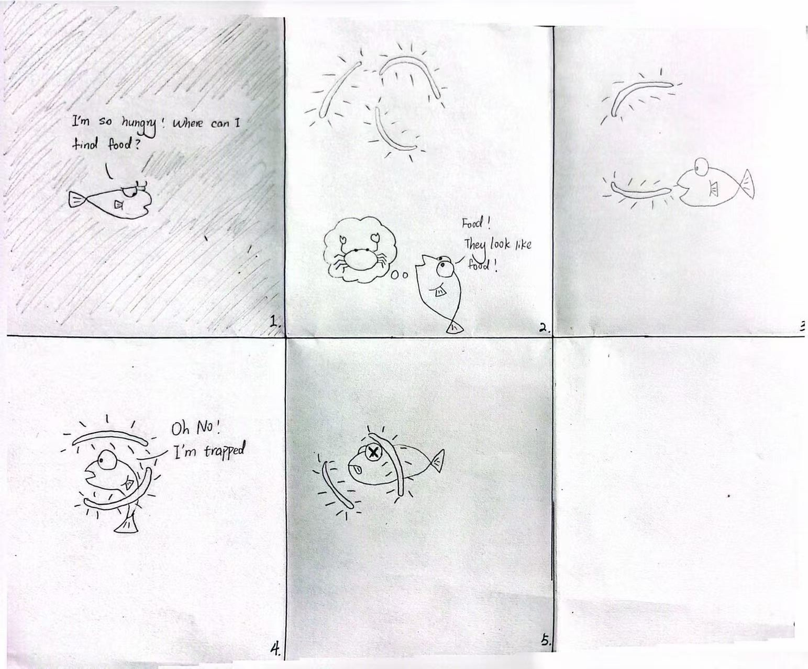
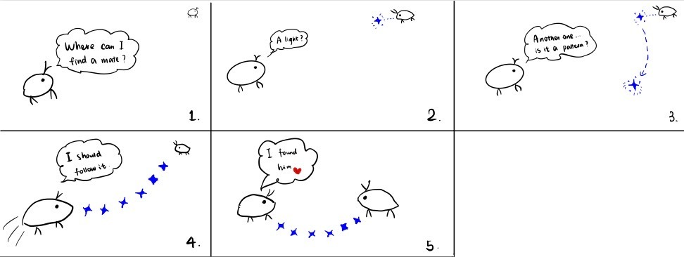

# Recreating the Masters of Interactive Light

**Collaborators:** Manrong Mao (mm3599), Wenqing Pan(wp273)

**Masterwork:** Bioluminescent Lures

# The Report

## Part 0. Know Your Master

### What is the masterwork?

Our masterwork is bioluminescent lures: the use of living light to attract, guide, communicate with, or deceive another animal in darkness. Unlike a human-designed device, it has no single inventor or creation date; bioluminescence evolved naturally across many species. Animals use these light signals for different purposes, including hunting, communication, and mating.

One of the most recognizable examples is the deep-sea anglerfish. Female anglerfish have a glowing structure called an esca that acts as a lure. In the darkness of the deep sea, prey notices the small light and may approach to investigate, allowing the hidden anglerfish to attack. Other organisms use light differently. For example, some ostracods produce patterns of light to attract mates.

The main input in this interaction is the behavior of another animal: noticing, approaching, following, or responding to the light. The response is the light-producing animal's next action, such as continuing the signal or attacking. The basic interaction can be described as:

**Light → Attention → Interpretation → Movement → Response**

The main players are the signaler, the receiver, and the dark environment that makes the light highly visible. A major strength of this interaction is that a very small amount of light can strongly influence another animal's behavior without physical contact. However, the signal does not guarantee success—prey may ignore the light or move away if it senses danger. The light can also reveal the signaler’s location to unintended animals. 

For our recreation, we will focus on the anglerfish's most recognizable interaction:

**Darkness → glowing lure → prey notices → prey approaches → predator attacks.**

The core interaction is not simply that the organism produces light, but that the light changes another creature's behavior and draws it closer.

# Part A. Plan

## Storyboard 1 — The Anglerfish: Light as Bait

### Setting

The scene takes place in the deep ocean at night, in near-total darkness. Most of the anglerfish's body is hidden, while its small glowing lure is visible.

### Players

- **Anglerfish / predator**
- **Small fish or crustacean / prey**

### Activity

The anglerfish remains hidden and presents its glowing lure. A small prey animal notices the isolated point of light from a distance.

The prey pauses and looks toward it.

The lure moves slightly.

The prey becomes curious and moves closer.

As the prey approaches, most of the predator remains invisible. Only after the prey enters striking distance does the anglerfish reveal itself and attack.

### Goals

**Anglerfish:** Attract food while minimizing the energy needed to chase prey.

**Prey:** Investigate something that appears interesting or potentially edible.

The two players therefore interpret exactly the same light differently:

- To the predator, it is a hunting tool.
- To the prey, it appears to be an opportunity.

### Storyboard

## Storyboard 2 — The Angler Siphonophore: Light as Disguise

### Setting

The second story also takes place in the deep sea, but instead of one isolated glowing bulb, several small glowing structures hang in the darkness.

### Players

- **Angler siphonophore (*Erenna sirena*)**
- **Fish**

### Activity

The siphonophore hangs glowing lures from its body. The lures resemble small luminous crustaceans or other possible prey.

A hungry fish sees several small glowing objects and interprets them as food.

It follows one of the lights.

Instead of finding prey, the fish moves into range of the siphonophore's tentacles and is captured.

MBARI describes *Erenna sirena* as using luminescent lures that mimic small crimson crustaceans to attract fish toward its tentacles.

### Goals

**Siphonophore:** Make itself appear less like a predator and make its lure appear like something edible.

**Fish:** Find food in an environment where food is difficult to locate.

Unlike Storyboard 1, where the attraction comes largely from curiosity toward a single light, this interaction emphasizes visual deception and mimicry.

### Storyboard

## Storyboard 3 — The Ostracod: Light as a Courtship Message

### Setting

The third story takes place at night in shallow Caribbean water.

### Players

- **Male ostracod**
- **Female ostracod**

### Activity

Instead of using light to capture another animal, the male uses light to communicate.

The male produces a sequence of bioluminescent pulses while moving through the water. The flashes create a recognizable pattern.

A female sees the pattern from a distance.

Rather than reacting to only one bright object, she responds to the timing and arrangement of the signals.

The female recognizes the pattern as belonging to an appropriate potential mate and moves toward the source.

Male ostracods can use species-specific sequences of bioluminescent signals during courtship, allowing females to distinguish their display from other lights in the environment.

### Goals

**Male ostracod:** Become visible to a potential mate and communicate species identity through a recognizable signal.

**Female ostracod:** Locate and identify an appropriate mate.

This storyboard changes the meaning of the light completely. The light is no longer deceptive bait. It becomes a message.

### Storyboard

# Part B. Act out the Interaction

After comparing the three storyboards, we chose **Storyboard 1: the deep-sea anglerfish** because it keeps light at the center of the interaction.

The core sequence is:

**Light appears → prey notices → prey approaches → predator is revealed.**

We acted it out with one person as the prey and the other controlling the lure in a dark room. Two things became clear:

- **The prey needs to hesitate.** If it approaches too quickly, the scene feels scripted rather than interactive.
- **The predator should stay hidden.** Seeing only the lure makes the deception much stronger.

**Better on paper than acted out:** repeated pauses felt too long, so we reduced them to one clear hesitation.

**New idea from acting:** when the prey hesitates, the lure can pulse or move slightly to regain its attention.

**Prey hesitates → lure responds → prey approaches.**

# Part C. Prototype the Light (light first!)

We used the phone light (tinkerbelle) as the anglerfish's glowing lure and we kept controlling its brightness and rhythm through the laptop (jane wren). In a dark room, we kept the light vocabulary simple: off while hidden, a soft white glow to attract attention, a slow pulse when the prey hesitates, and a steadier/brighter glow as it moves closer.

We focused on four qualities: **contrast, brightness, rhythm, and timing.** The lure had to be visible without revealing the predator, feel organic rather than like an alarm, and respond to the prey's movement instead of following a fixed animation.

We deliberately kept the prototype centered on light. The goal was not to reproduce the biology perfectly, but to make one interaction immediately readable: The light makes the prey curious enough to move toward it.

# Part D. Wizard the Device

One collaborator will act as the prey and anglerfish while the other collaborator secretly controls the Tinkerbelle interface from a computer.

The wizard will control the prey's movement and another collaborator will select the appropriate light state.

**Prey enters → Wizard turns lure on**

**Prey notices → Wizard holds steady glow**

**Prey hesitates → Wizard adds a slow pulse**

**Prey approaches → Wizard returns to steady glow**

**Prey reaches striking distance → Predator is revealed**

The wizard always remains outside the camera frame so that the audience experiences the light as if it is independently reacting to the prey.

Our first attempts at recording the wizarded set-up: <https://drive.google.com/file/d/1wOsuRmbmU25wWYsJNgzsgipFuJpKOJGz/view?usp=sharing>

# Part F. Record

### Final Video

<https://cornell.zoom.us/rec/play/Ah_D09KKweKTYq5s5K3NyY1C5qRpGgTvu06cAA9htSGxLLW-9KAvZuzEcbXjNYajkLXIeAFXLkxBmsuT.On3WV0Wt4C12rrLn?accessLevel=meeting&canPlayFromShare=true&from=my_recording&continueMode=true&oldStyle=true&componentName=rec-play&originRequestUrl=https%3A%2F%2Fcornell.zoom.us%2Frec%2Fshare%2FOjL8XTB7Rxzb3IDZaUG28jEE2pqtPNxSOi4gTWKqsvtHTb7Gw2EvSyebjm0AfFYM.MNb5dc2zNoiy-62n>

Our aim was to make the anglerfish’s hunting interaction immediately understandable. A viewer should be able to recognize how bioluminescent light functions as a lure in the darkness of the deep sea: the prey notices the light, becomes curious, approaches it, and eventually moves close enough for the hidden predator to attack. The key idea we wanted to communicate is that the light is not simply illumination—it is a signal that changes the behavior of another animal.

Non-sequential interaction sketch: The sketch shows the relationship between the anglerfish, its bioluminescent lure, and the prey. The interaction is not completely fixed: the prey may approach, hesitate, or move away. In response, the lure can change its brightness, pulsing frequency, and movement to regain the prey’s attention and encourage it to move closer. This shows the interaction as a responsive loop rather than a fixed sequence.

Collaborators & influences: Wenqing Pan performed both the anglerfish and the prey in the final video. Manrong Mao acted as the hidden wizard, controlling the light’s brightness, pulsing frequency, and movement in response to the prey’s behavior. Together, we used the light to recreate the anglerfish’s bioluminescent hunting strategy in the deep sea.

## Research Sources

- **NOAA Ocean Exploration — “Fishes of the Midnight Zone”**: information about deep-sea environments, anglerfish lures, and the energetic advantage of attracting prey rather than searching for it.
- **MBARI — “Deep-sea anglerfish”**: information about the illicium, esca, glowing bacteria, prey attraction, and anglerfish hunting behavior.
- **MBARI — “Angler siphonophore”**: information about *Erenna sirena* and its luminescent prey-mimicking lures.
- **Smithsonian Ocean — “Bioluminescence”**: examples of bioluminescence used for feeding, communication, and attracting mates.
- **Smithsonian Ocean — “You Light Up My World!”**: information about species-specific ostracod courtship displays.

---

# Part 2 — ReMastering the light

*This describes the second week's work for this lab activity.*

## Prep (before the next lab)

Find three other groups. (How? Maybe Slack?) Visit their Lab Hub pages, watch their
videos, and give them reactions and feedback: tell them what you saw happening,
guess the masterwork and the goals of the characters, and ask about anything that
wasn't clear.

**Who were the other groups you kibitzed with? Add links to their project pages here.**
**Summarize the feedback you got from your partners here.**

## Remix, Update, or Critique the Master

Now that you understand your masterwork from the inside, respond to it. Do the
recreation again, but this time make it your own — pick one of these moves (or
combine them):

1. **Remix the modality.** Your recreation no longer has to (just) use light. Use
   vibration, sound, motion, heat — whatever best carries the interaction. Feel
   free to fork and modify the Tinkerbelle code. (Add your updates to this lab's folder!)
2. **Update it.** Redesign the piece for today's context, or for a setting its
   creators never imagined (the piece with roommates in the room, with children
   present, on a phone, in a car).
3. **Fix its weaknesses.** You identified this master's strengths and weaknesses
   in Part 0 — now address a weakness, or push a strength further.

We will grade this second pass with an emphasis on **creativity** and on how well
your response engages with what your master was really doing.

**Document everything here — especially the storyboard and video. Photos of the
prototype are great too.**

---

*Assignment lineage: this lab merges "Staging Interaction" (Interactive Lab Hub)
with "Recreating the Masters" (Interaction Design Studio, Profs. Scott Minneman &
Wendy Ju). Massive list of interactive light masterworks generated by Claude.ai.*
