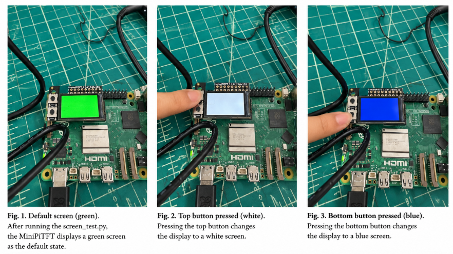
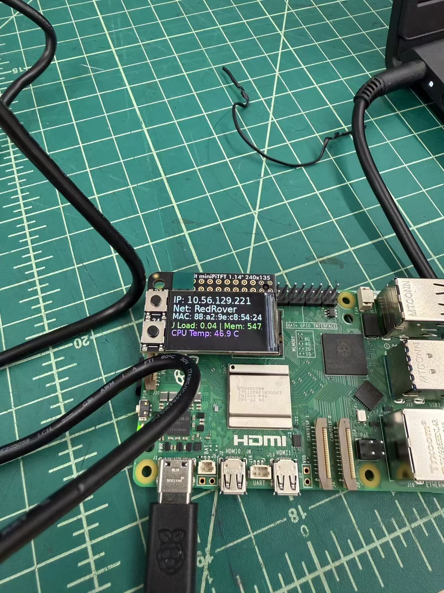
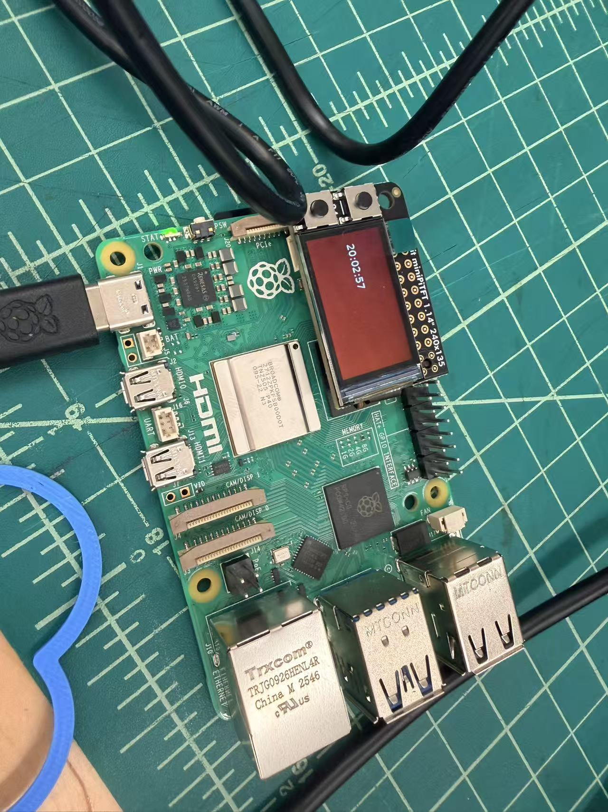
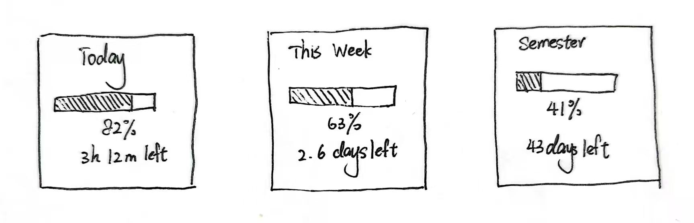
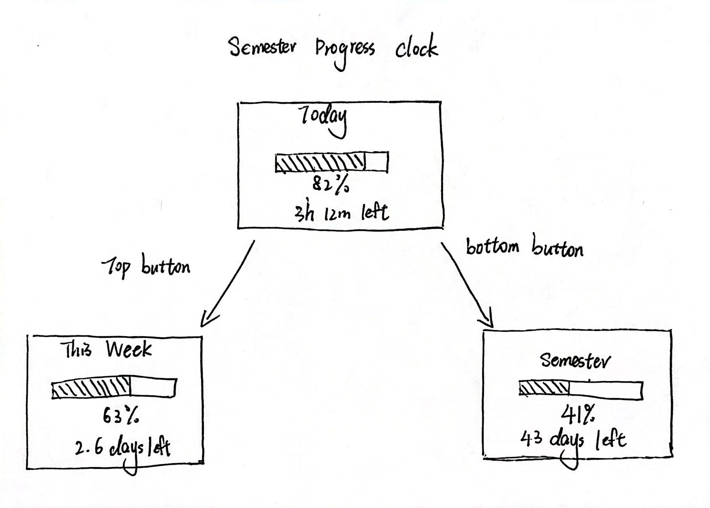
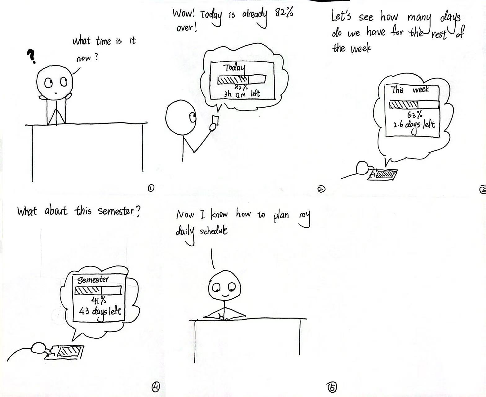
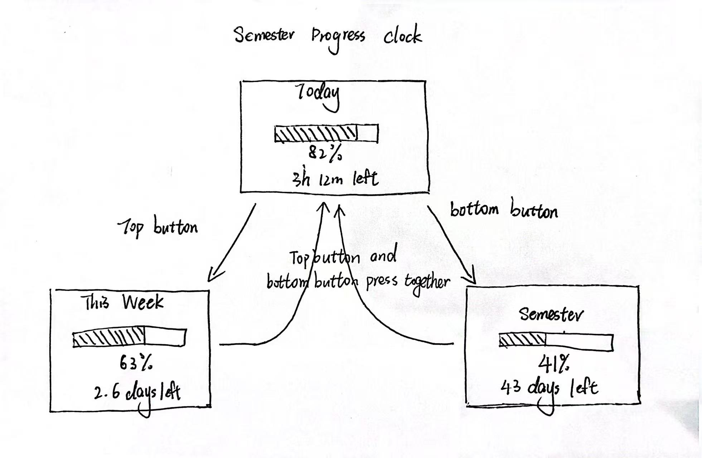

# Interactive Prototyping: The Clock of Pi
**NAMES OF COLLABORATORS HERE**

**Collaborators: Manrong Mao (mm3599), Wenqing Pan(wp273)**

Does it feel like time is moving strangely during this semester?

For our first Pi project, we will pay homage to the [timekeeping devices of old](https://en.wikipedia.org/wiki/History_of_timekeeping_devices) by making simple clocks.

It is worth spending a little time thinking about how you mark time, and what would be useful in a clock of your own design.

**Please indicate anyone you collaborated with on this Lab here.**
Be generous in acknowledging their contributions! And also recognizing any other influences (e.g. from YouTube, Github, Twitter) that informed your design. 

## Prep

1. ### Set up your Lab 2 Github

At the start of lab Wednesday, ensure you have the latest lab content by updating your forked repository. 

**📖 [Follow the step-by-step guide for safely updating your fork](pull_updates/README.md)**

This guide covers how to pull updates without overwriting your completed work, handle merge conflicts, and recover if something goes wrong.


2. ### Get Kit and Inventory Parts
Take inventory of the kit parts that you have, and note anything that is missing:

***Update your [parts list inventory](partslist.md)***

3. ### Prepare your Pi for lab this week
[Follow these instructions](prep.md) to download and burn the image for your Raspberry Pi before lab Wednesday.


## Overview
For this assignment, you are going to 

A) [Connect to your Pi](#part-a)  

B) [Try out cli_clock.py](#part-b) 

C) [Set up your RGB display](#part-c)

D) [Try out clock_display_demo](#part-d) 

E) [Modify the code to make the display your own](#part-e)

F) [Make a short video of your modified barebones PiClock](#part-f)

G) [Sketch and brainstorm further interactions and features you would like for your clock for Part 2.](#part-g)

## The Report
This readme.md page in your own repository should be edited to include the work you have done. You can delete everything but the headers and the sections between the \*\*\***stars**\*\*\*. Write the answers to the questions under the starred sentences. Include any material that explains what you did in this lab hub folder, and link it in the readme.

Labs are due on Sunday midnight. Make sure this page is linked to on your main class hub page.

## Part A. 
### Connect to your Pi
Just like you did in the lab prep, ssh on to your pi. Once you get there, create a Python environment (named venv) by typing the following commands.

```
ssh pi@<your Pi's IP address>
...
pi@raspberrypi:~ $ python -m venv venv
pi@raspberrypi:~ $ source venv/bin/activate
(venv) pi@raspberrypi:~ $ 

```
### Setup Personal Access Tokens on GitHub
Set your git name and email so that commits appear under your name.
```
git config --global user.name "Your Name"
git config --global user.email "yourNetID@cornell.edu"
```

The support for password authentication of GitHub was removed on August 13, 2021. That is, in order to link and sync your own lab-hub repo with your Pi, you will have to set up a "Personal Access Tokens" to act as the password for your GitHub account on your Pi when using git command, such as `git clone` and `git push`.

Following the steps listed [here](https://docs.github.com/en/authentication/keeping-your-account-and-data-secure/managing-your-personal-access-tokens) from GitHub to set up a token. Depends on your preference, you can set up and select the scopes, or permissions, you would like to grant the token. This token will act as your GitHub password later when you use the terminal on your Pi to sync files with your lab-hub repo.


## Part B. 
### Try out the Command Line Clock
Clone your own lab-hub repo for this assignment to your Pi and change the directory to Lab 2 folder (remember to replace the following command line with your own GitHub ID):

```
(venv) pi@raspberrypi:~$ git clone https://github.com/<YOURGITID>/Interactive-Lab-Hub.git
(venv) pi@raspberrypi:~$ cd Interactive-Lab-Hub/Lab\ 2/
```
Depends on the setting, you might be asked to provide your GitHub user name and password. Remember to use the "Personal Access Tokens" you just set up as the password instead of your account one!

Check if the directory has clone sucessfully, you should see the Interactive-Lab-Hub under the home directory listed:
```
(venv) pi@raspberrypi:~ $ ls
Bookshelf      Documents            Music     Public                 venv
create_img.sh  Downloads            pi-apps   screen_boot_script.py  Videos
Desktop        Interactive-Lab-Hub  Pictures  Templates
(venv) pi@raspberrypi:~ $
```


Install the packages from the requirements.txt and run the example script `cli_clock.py`:

```
(venv) pi@raspberrypi:~/Interactive-Lab-Hub/Lab 2 $ pip install -r requirements.txt
(venv) pi@raspberrypi:~/Interactive-Lab-Hub/Lab 2 $ python cli_clock.py 
02/24/2021 11:20:49
```

The terminal should show the time, you can press `ctrl-c` to exit the script.
If you are unfamiliar with the Python code in `cli_clock.py`, have a look at [this Python refresher](https://hackernoon.com/intermediate-python-refresher-tutorial-project-ideas-and-tips-i28s320p). If you are still concerned, please reach out to the teaching staff!


## Part C. 
### Set up your RGB Display
We have asked you to equip the [Adafruit MiniPiTFT](https://www.adafruit.com/product/4393) on your Pi in the Lab 2 prep already. Here, we will introduce you to the MiniPiTFT and Python scripts on the Pi with more details.


The Raspberry Pi 5 has a variety of interfacing options. When you plug the pi in the red power LED turns on. Any time the SD card is accessed the green LED flashes. It has standard USB ports and HDMI ports. Less familiar it has a set of 20x2 pin headers that allow you to connect a various peripherals.


To learn more about any individual pin and what it is for go to [pinout.xyz](https://pinout.xyz/pinout/3v3_power) and click on the pin. Some terms may be unfamiliar but we will go over the relevant ones as they come up.

### Hardware (you have already done this in the prep)

From your kit take out the display and the [Raspberry Pi 5](https://www.google.com/url?sa=i&url=https%3A%2F%2Fwww.raspberrypi.com%2Fproducts%2Fraspberry-pi-5%2F&psig=AOvVaw330s4wIQWfHou2Vk3-0jUN&ust=1757611779758000&source=images&cd=vfe&opi=89978449&ved=0CBMQjRxqFwoTCPi1-5_czo8DFQAAAAAdAAAAABAE)

Line up the screen and press it on the headers. The hole in the screen should match up with the hole on the raspberry pi.

<p float="left">


</p>

### Testing your Screen

The display uses a communication protocol called [SPI](https://www.circuitbasics.com/basics-of-the-spi-communication-protocol/) to speak with the raspberry pi. We won't go in depth in this course over how SPI works. The port on the bottom of the display connects to the SDA and SCL pins used for the I2C communication protocol which we will cover later. GPIO (General Purpose Input/Output) pins 23 and 24 are connected to the two buttons on the left. GPIO 22 controls the display backlight.

To show you the IP and Mac address of the Pi to allow connecting remotely we created a service that launches a python script that runs on boot. For the following steps stop the service by typing ``` sudo systemctl stop piscreen.service --now```. Othwerise two scripts will try to use the screen at once. You may start it again by typing ``` sudo systemctl start piscreen.service --now```

We can test it by typing 
```
(venv) pi@raspberrypi:~/Interactive-Lab-Hub/Lab 2 $ python screen_test.py
```

You can type the name of a color then press either of the buttons on the MiniPiTFT to see what happens on the display! You can press `ctrl-c` to exit the script. Take a look at the code with
```
(venv) pi@raspberrypi:~/Interactive-Lab-Hub/Lab 2 $ cat screen_test.py
```

#### Displaying Info with Texts
You can look in `screen_boot_script.py` for how to display text on the screen!

#### Displaying an image

You can look in `image.py` for an example of how to display an image on the screen. Can you make it switch to another image when you push one of the buttons?

\*\*\***Include a picture of your own Raspberry Pi displaying the piscreen.service with your unique MAC address. Additionally, please provide another picture showing the successful completion of the screen test.**\*\*\*

### Raspberry Pi screen test
### Mac address info
MiniPiTFT displaying the Raspberry Pi's network information and unique MAC address through `piscreen.service`.


## Part D. 
### Set up the Display Clock Demo
Work on `screen_clock.py`, try to show the time by filling in the while loop (at the bottom of the script where we noted "TODO" for you). You can use the code in `cli_clock.py` and `stats.py` to figure this out.

### How to Edit Scripts on Pi
Option 1. One of the ways for you to edit scripts on Pi through terminal is using [`nano`](https://linuxize.com/post/how-to-use-nano-text-editor/) command. You can go into the `screen_clock.py` by typing the follow command line:
```
(venv) pi@raspberrypi:~/Interactive-Lab-Hub/Lab 2 $ nano screen_clock.py
```
You can make changes to the script this way, remember to save the changes by pressing `ctrl-o` and press enter again. You can press `ctrl-x` to exit the nano mode. There are more options listed down in the terminal you can use in nano.

Option 2. Another way for you to edit scripts is to use VNC on your laptop to remotely connect your Pi. Try to open the files directly like what you will do with your laptop and edit them. Since the default OS we have for you does not come up a python programmer, you will have to install one yourself otherwise you will have to edit the codes with text editor. [Thonny IDE](https://thonny.org/) is a good option for you to install, try run the following command lines in your Pi's ternimal:

  ```
  pi@raspberrypi:~ $ sudo apt install thonny
  pi@raspberrypi:~ $ sudo apt update && sudo apt upgrade -y
  ```

Now you should be able to edit python scripts with Thonny on your Pi.

Option 3. A nowadays often preferred method is to use Microsoft [VS code to remote connect to the Pi](https://www.raspberrypi.com/news/coding-on-raspberry-pi-remotely-with-visual-studio-code/). This gives you access to a fullly equipped and responsive code editor with terminal and file browser.  

Pro Tip: Using tools like [code-server](https://coder.com/docs/code-server/latest) you can even setup a VS Code coding environment hosted on your raspberry pi and code through a web browser on your tablet or smartphone! 

[View the clock display code](screen_clock.py#L63-L74)
### Time shows in the screen

## Part E. Read Part 2. Sketch and brainstorm further interactions and features you would like for your clock.

### Time as Progress 
My idea is to create a clock that represents **time as progress** rather than displaying the current hour and minute. Instead of telling users what time it is, the clock shows how much of a meaningful time period has already passed and how much remains. Users can view progress at different scales, including **Today**, **This Week**, and **Semester**. The two physical buttons on the MiniPiTFT would support different interactions. **Button A** switches between time scales, allowing the user to cycle through Today, This Week, and Semester. **Button B** switches between different ways of visualizing the same time information, such as a **progress bar**, **percentage completed**, or **time remaining**. The display color could also gradually change as the end of the selected time period approaches. For example, the screen could begin with a calmer color when most of the time remains and gradually shift as the period gets closer to completion. The goal of this concept is to make time feel more **visual, contextual, and tangible**. Rather than functioning as a traditional digital or analog clock, it helps users understand where they currently are within a larger period of time. 

### Interaction Sketch 

### Verplank diagrams

### Storyboard

# Lab 2 Part 2

## Prep 

1. Pick up remaining parts for kit on Wednesday lab class. Check the updated [parts list inventory](partslist.md) and let the TA know if there is any part missing.

2. Look at and give feedback on the Part E. for at least 3 other people in the class and get 3 people to comment on your Part E!)
**Put the feedback for your ideas here.**

**Put the names of the people you gave feedback to here. (Even better, add links to their repos here!)**

https://github.com/Morinzzz/Interactive-Lab-Hub/tree/Fall2026/Lab%202

Morin Zhou

I like how simple and clear the idea is. Showing today, week, and semester progress makes time feel more visible than a normal clock. The storyboard is also easy to follow. One thing I was confused about is the top/bottom button mapping, because I would not immediately know which button leads to which view. I also think the ending about “planning my daily schedule” is a little stronger than what the device actually does. Maybe the final benefit could focus more on understanding how much time is left.

https://github.com/certaindragon3/Interactive-Lab-Hub/tree/Fall2026/Lab%202 

Jiesen Huang

Hi! I like this idea a lot — it feels very doable on the MiniPiTFT, and the Today / This Week / Semester scales are genuinely useful. One thing that could make it more fun and less like a plain progress bar is adding some motion that carries meaning. For example, when Button A switches scales, the Today bar could shrink and slide into its slot inside the week, and the week could shrink into the semester, so you actually see how the time periods nest. You could also add small moments at milestones (a little burst at 25/50/75%, or something celebratory at the end of the day or week), or make the fill feel physical, like liquid that gently sloshes when you press a button. Right now Button B shows the same number three ways; maybe one of those views could be a more playful metaphor instead. Also, the Semester view will need start and end dates, so it's worth deciding where those get set. — Jiesen

https://github.com/ctyaaaaao/Interactive-Lab-Hub/blob/Fall2026/Lab%202/README.md

Ziyao Zhang

I really like the idea of seeing how much of the day is left because it could make me look forward to the end of the day. One thing I would be curious about is whether showing the percentage could also make some users feel pressured when there is not much time left. Maybe users could choose between seeing time passed and time remaining.

## Modify the barebones clock to make it your own

### Barebones Prototype

For the barebones version, I focused only on showing the progress of one day. To make the change visible in a short demo, I sped up the clock so that 1 real-world second represents 1 hour in the simulated day. This means the full 24-hour cycle can be shown in about 24 seconds. The progress bar, percentage, and remaining time update as the simulated day moves from 0% to 100%.

[View the barebones code](progress_clock_barebones.py)

## Make a short video of your modified barebones PiClock

[View the PiClock barebones Demo Video](https://drive.google.com/file/d/1XArrm53nRL9w2wQQC07nSxpQ5ouQ_5Re/view?usp=sharing)

## Now, make your own PiClock

[View the PiClock code](progress_clock.py)

As always, make sure you document contributions and ideas from others (and AI) explicitly in your writeup.

You are permitted (but not required) to work in groups and share a turn in; you are expected to make equal contribution on any group work you do, and N people's group project should look like N times the work of a single person's lab.  Make sure the page for the group turn in is linked to your personal Interactive Lab Hub page. 


## Idea Update

Our updated idea is to create a clock that represents **time as progress** rather than displaying the current hour and minute. Instead of telling users the exact time, the clock helps them understand **how far they are through a meaningful period of time and how much time remains**.

The clock has three states: **Today, This Week, and This Semester**. By default, the screen displays **Today**. Pressing the **top button** switches the display to **This Week**, while pressing the **bottom button** switches it to **This Semester**. **Pressing both buttons at the same time returns the display to Today.** This interaction allows users to quickly move between different scales of time.

Each state follows the same visual structure. At the top of the screen, a title identifies the selected time period, such as **“TODAY,” “THIS WEEK,” or “THIS SEMESTER.”** Below the title, the clock displays the **percentage of the selected period that has already passed**, followed by a **progress bar** that visually represents that percentage. The progress bar gradually changes from **green to yellow** as the selected time period approaches its end. At the bottom, the clock shows the **remaining time**, such as the number of **hours left today** or the number of **days left in the week or semester**.

The goal is to make time feel more **visual, contextual, and tangible**. Rather than functioning as a traditional clock, the display allows users to immediately understand where they are within the day, week, or semester and how much time they still have left.


### Verplank diagrams Update

Based on our updated concept and interaction design, we revised our Verplank diagram to reflect the three time-progress states and the button interactions of the final PiClock design.

 Interaction Sketch 
 *Figure: Updated Verplank diagram for the Time as Progress PiClock.*

## Video

[View the PiClock Demo Video](https://drive.google.com/file/d/1eIPRVkOcaO76HwnGPQz10AnstmlGSCur/view?usp=drive_link)
