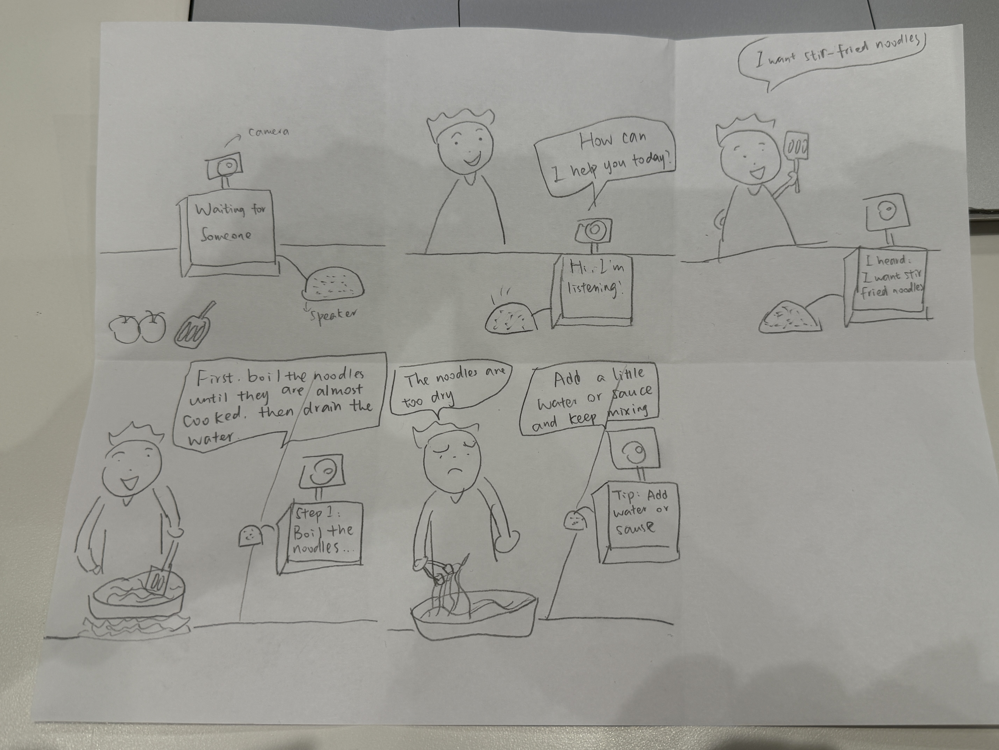
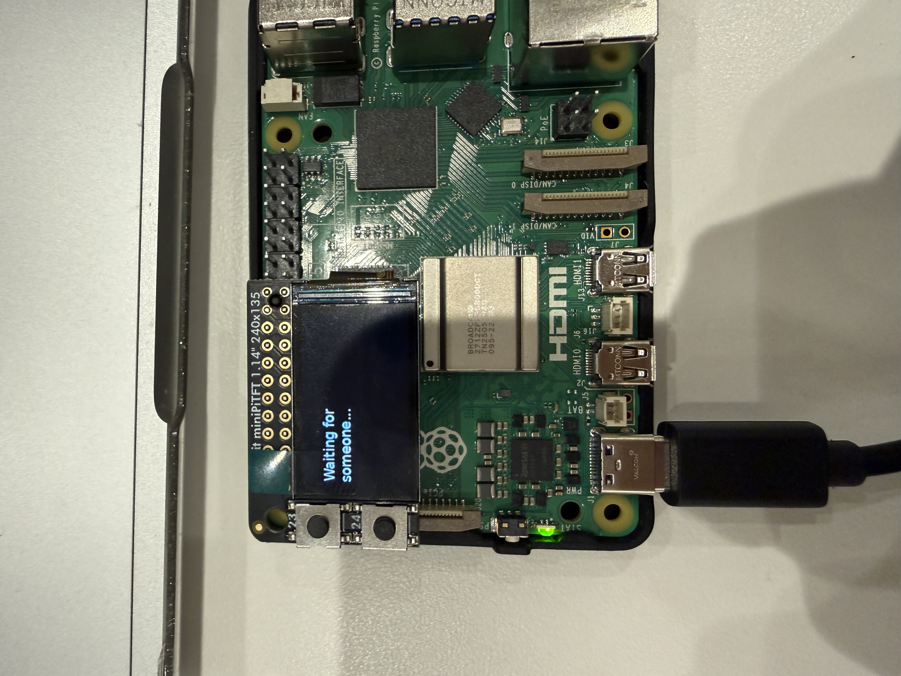
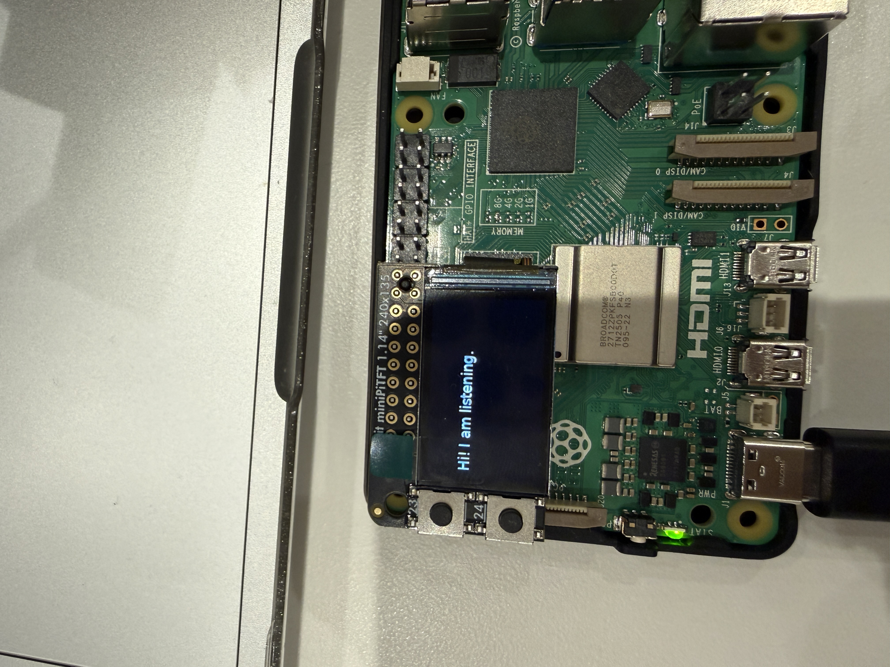
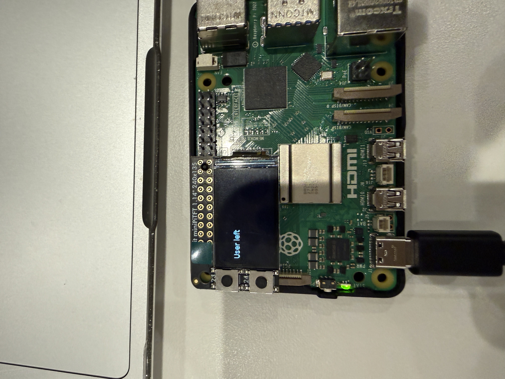
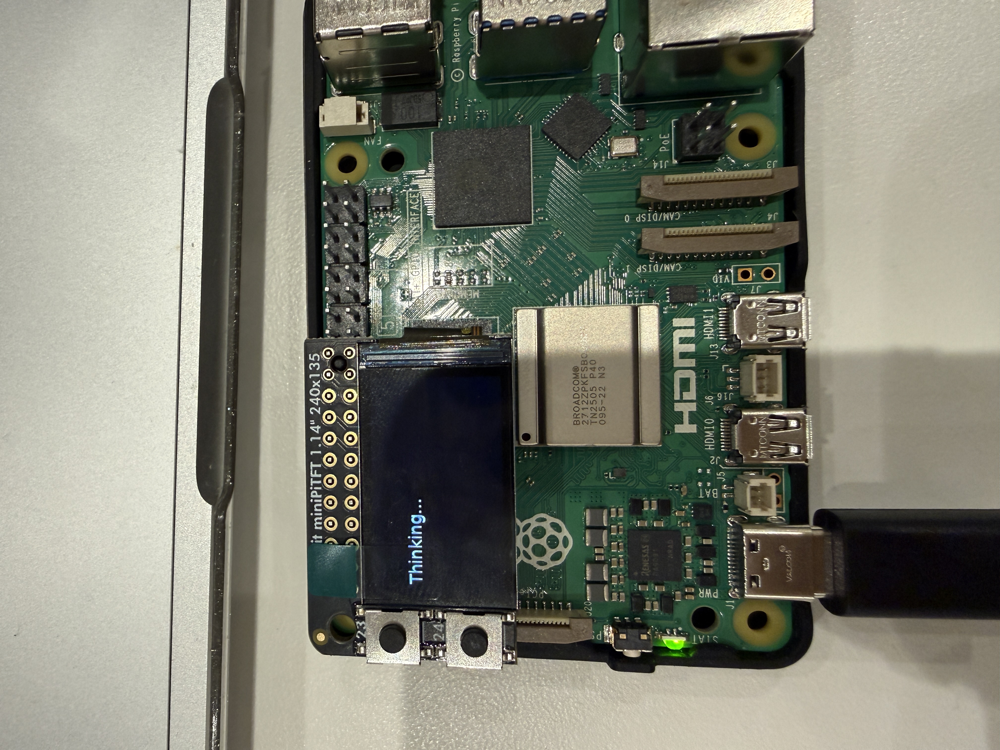
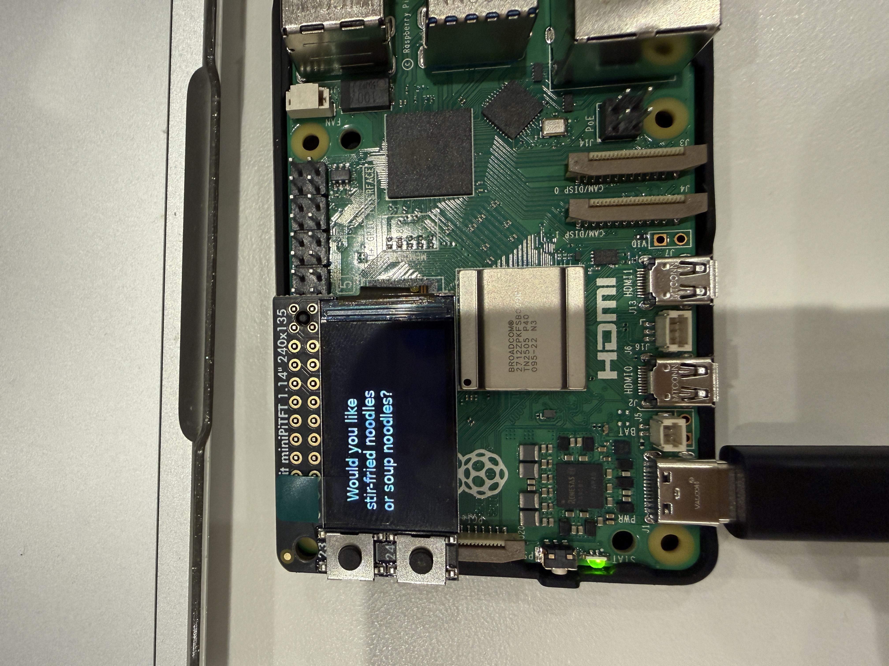
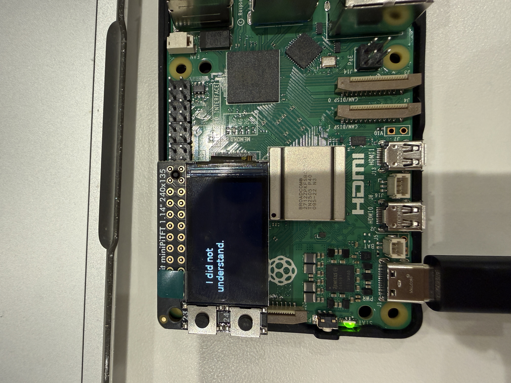

# Chatterboxes

**NAMES OF COLLABORATORS HERE**

Mandy Mao (mm3599)

---

# Part 1


## A. Text to Speech

\*\***Write your own shell file to use your favorite of these TTS engines to have your Pi greet you by name.**\*\*
(This shell file should be saved to your own repo for this lab.)

[My Greeting Script](speech-scripts/mandy_greeting.sh)

\*\***Then answer: Is the same greeting, in these different voices, the same greeting? Describe one concrete way the voice changed what the utterance seemed to mean or who seemed to be speaking.**\*\*

**Reflection**: I don't think the same greeting feels exactly the same in different voices. The espeak voice sounds very robotic, so the greeting feels more like a machine giving information. Festival sounds a little more natural, but it still feels old and mechanical. Piper sounds much more human and friendly. When Piper says “Hello Mandy, welcome back,” it feels more like a real assistant talking to me instead of a computer reading text. The words are the same, but the voice changes the personality of the device and how I understand the greeting.

## B. Speech to Text

\*\***Record a few seconds of your own speech (`arecord -d 5 -f cd -c 1 -r 16000 test.wav`) and transcribe it with at least two model sizes. Report the real-time factor for each. At what point does the accuracy improvement stop being worth the delay, for a system that has to answer you?**\*\*

**Reflection**: I tested three Whisper model sizes using the same 5-second recording by saying "hello, my name is Mandy. How are you?" The tiny.en model was the fastest with a real-time factor of 0.21x, but it made one mistake and recognized my name “Mandy” as “Maggie.” The base.en model correctly recognized the full sentence and had a real-time factor of 0.40x. The small.en model was also correct, but its real-time factor was 1.18x, so it took longer than the audio itself. For an interactive system, I think base.en is the best balance. It was accurate enough, while small.en did not improve the result but added much more delay.


\*\***Write your own script that verbally asks for a numerical input (a phone number, zipcode, number of pets) and records the answer the respondent provides.**\*\* Numbers are a good stress test — transcription systems make characteristic errors on digit strings, and you will want to know what they are before you design around them.

**Reflection**: I also tested the system with a numerical input. The device asked for my zip code and recorded my answer. I said “0044,” and the base.en model correctly transcribed it as “0044.” This test worked better than I expected because digit strings can sometimes be difficult for speech recognition systems.


## C. Turn-taking: knowing when someone has stopped talking

\*\***Try both extremes, and something in between. Describe what each one feels like to talk to. Note specifically: at 0.2s, what kinds of normal speech get cut off? At 1.5s, what does the delay make the system seem like?**\*\*

There is no correct value. A system that takes drink orders and a system that listens to someone think out loud want very different thresholds, and the right one depends on what your users are doing with their pauses.

**Reflection**: At 0.2 seconds, the system was too sensitive to pauses. I said “I want to order... a cup of coffee... with some milk,” and it separated my speech into three different utterances. This means normal pauses for thinking or breathing can make the system think the user is finished. At 0.7 seconds, the whole sentence was recognized as one utterance, and the interaction felt much more natural. At 1.5 seconds, the full sentence was also recognized correctly, but I had to wait longer after I finished speaking. The longer delay made the system feel slower and made me wonder if it had heard me. For this type of conversation, I think 0.7 seconds feels like a better balance between giving the user time to pause and responding quickly.

### The complete loop

`echo_bot.py` puts the pieces together: it listens, endpoints, transcribes, and speaks a reply through Piper. The dialogue policy is deliberately trivial — it repeats what you said — so that everything you notice is a property of the timing rather than the content.

```
(.venv) $ python echo_bot.py
```

## D. Storyboard

Storyboard and/or use a Verplank diagram to design a speech-enabled device. (Stuck? Make a device that talks for dogs. If that is too stupid, find an application that is better than that.)


Write out what you imagine the dialogue to be. Use cards, post-its, or whatever method helps you develop alternatives or group responses.

Your script should include the pauses. Where does your device wait, and for how long? You now know from Part C that this is a parameter you have to choose, not something that happens for free.

**Process description:** I started with the idea of a cooking assistant because cooking is a situation where touching a phone is not always convenient. I wanted the interaction to be mostly voice-based, so the user can keep cooking while asking questions. I also thought about the pauses people make when they are looking at ingredients or thinking about what to say. From the turn-taking test, 0.2 seconds felt too short because it cut normal speech into different parts. I chose around 0.7 seconds for this design because it gives users time to pause but still keeps the conversation responsive.

## E. Acting out the dialogue

Find a partner, and *without sharing the script with your partner* try out the dialogue you've designed, where you (as the device designer) act as the device you are designing. Please record this interaction (for example, using Zoom's record feature).

\*\***Describe if the dialogue seemed different than what you imagined when it was acted out, and how.**\*\*

The dialogue was a little different from what I imagined. I expected the user to just follow the cooking steps and ask what to do next, but my partner also mentioned a problem during cooking and said the noodles were too dry. This made the conversation less predictable than my original script. I had to respond to the problem instead of only giving the next step. I also noticed that the user sometimes paused before answering, especially when choosing between stir-fried noodles and soup noodles. This made me think that the assistant needs to wait long enough before responding and also be flexible enough to handle unexpected cooking problems.

**Video Link** https://drive.google.com/file/d/17OUhwJKZWt5uUMjQTxlAQvydRXWyVfWM/view?usp=sharing

---

# Lab 3 Part 2

For Part 2, you will redesign the interaction with the speech-enabled device using the data collected, as well as feedback from part 1.

## Prep for Part 2

1. What are concrete things that could use improvement in the design of your device? For example: wording, timing, anticipation of misunderstandings.

In Part 1, I designed the assistant mostly for users who ask for the next cooking step. During the role-play, my partner also said the noodles were too dry. I did not plan this problem in my first dialogue. In Part 2, I want the assistant to answer this kind of unexpected cooking problem, and not only follow a fixed recipe.

In Part 1, the interaction used mostly speech, so the user could not clearly see when the device was listening or thinking. In Part 2, I added screen messages for waiting, listening, thinking, and not understanding. The camera can start the interaction when it sees a user, so the user does not need to press a button.

I also tested silence timing in Part 1. The 0.2 second setting cut my speech into parts, and the 1.5 second setting made the device feel slow. At that time, I chose about 0.7 seconds because it felt like a better balance. When I tested the complete Part 2 prototype, it still answered before I finished some sentences, so I increased the silence time to 1.3 seconds. The current prototype uses 1.3 seconds. I also want it to understand different ways to ask the same question, such as “What's next?” and “What should I do next?” If it do not understand, it should ask the user to repeat instead of giving a wrong cooking instruction.

2. What are other modes of interaction *beyond speech* that you might also use to clarify how to interact? In particular: how does someone know when the device is listening, and when it is thinking? You have a screen and an LED.

I use the screen to show the device state. When the camera waits for a person, the screen says “Waiting for someone...” When the camera sees a face, the device says the greeting and the screen says “Hi! I am listening.” When the device processes speech, the screen says “Thinking...” If it cannot understand the user, the screen says “I did not understand.” These messages help the user know when to speak and when to wait. The camera also starts the interaction without a button.

3. Make a new storyboard, diagram and/or script based on these reflections.



4. (optional) Integrate [input devices](inputs.md) in the system

I didn't integrate input devices.

## Prototype your system

The system should:
* use the Raspberry Pi
* use one or more sensors
* require participants to speak to it

*Document how the system works.*

### How the System Works

My prototype runs on a Raspberry Pi 5. A USB camera checks for a face, and the MiniPiTFT screen shows the current state. When the camera detects a face for several frames, the device displays “Hi! I am listening” and Piper says, “Hi, how can I help you today?” The device then listens to the USB microphone. Silero VAD waits for about 1.3 seconds of silence to decide that the user finished speaking. Faster Whisper changes the recording into text.

The program checks the transcript for keywords and selects an intent. It supports noodles, stir-fried noodles, soup noodles, next step, adding noodles, noodles that are too dry or too soft, cooking time, repeat, and unknown requests. The assistant displays and speaks a response with Piper. For example, a “too dry” request makes the screen show “Tip: Add a little water or sauce.” The repeat intent says the previous assistant response again. If the program does not understand the transcript, it asks the user to repeat.

The program records each recognized turn in `lab3b/data/interactions.csv`. The CSV includes the timestamp, participant ID, whether the user was present, transcript, detected intent, system response, and response time. The camera continues checking for a face during the conversation. If it does not confirm a face for about six seconds, the program shows “User left” and returns to “Waiting for someone...” The screen gives the user status feedback. The current intent detection uses keywords, so it can misunderstand speech that does not match the expected phrases.

I included photos and test videos of the system. The TA confirmed that a separate controller is not required for this prototype.









## Test the system

Try to get at least two people to interact with your system. (Ideally, you would inform them that there is a wizard *after* the interaction, but we recognize that can be hard.)

Two tests:
https://drive.google.com/file/d/1yu-eVVaYAzcJdoJHLIaL6gpTW7Wa008x/view?usp=sharing 

https://drive.google.com/file/d/14qq4naJYGBuSkp4B7u666L5_ojMMnwuB/view?usp=sharing

One participant used the expected cooking phrases, so the keyword matching worked well. The other participant used a different wording for a request, and the system had more difficulty identifying the intent.

Answer the following:

### What worked well about the system and what didn't?

In the recorded tests, the camera started the conversation after it detected a face. The device played the greeting, showed the listening and thinking messages, and answered clear cooking questions. The CSV logger saved the transcript, intent, response, and response time. The tests also showed some problems. The camera sometimes lost a face or detected a face by mistake. Whisper made mistakes with unclear speech, and the keyword system did not understand every way of asking a question. The system worked better when the user spoke clearly and faced the camera.

### What worked well about the controller and what didn't?

### What worked well about the controller and what didn't?

The TA confirmed that a separate controller was not required for my prototype, so I did not use a human-operated controller in Part 2. Instead, the system automatically selected responses using keyword-based intent detection. This made the prototype easier to run and allowed the participant to interact with it without seeing another interface. However, this also removed the flexibility of a human wizard. If Whisper produced a wrong transcript or the user's request did not match one of my keywords, the system could not manually correct the mistake and often had to ask the user to repeat.

### What lessons can you take away from the WoZ interactions for designing a more autonomous version of the system?

In my Part 1 role-play, my partner said the noodles were too dry, even though my first script did not include this problem. This showed me that users do not always follow the dialogue I planned. A more autonomous assistant should understand different ways to say the same request and handle unexpected cooking problems. It should ask the user to repeat or clarify unclear speech instead of giving a wrong instruction. The system also needs enough silence time for a user to think, but it should not make the user wait too long. The screen should show when the device is listening or thinking.

### How could you use your system to create a dataset of interaction? What other sensing modalities would make sense to capture?

My program saves each interaction in a CSV file. It records the timestamp, participant ID, user presence, transcript, detected intent, system response, and response time. I can use this dataset to find which requests the system understands and which requests it misses. I can also compare response times and improve the intent keywords. In future tests, I could record speech start and end times, screen state changes, and when the camera detects a face. A temperature or weight sensor could also record information about the cooking process. I should ask participants for permission and avoid saving identifiable video or audio when it is not needed.

<details>
  <summary><strong>Submission Cleanup Reminder (Click to Expand)</strong></summary>

  **Before submitting your README.md:**
  - This readme.md file has a lot of extra text for guidance.
  - Remove all instructional text and example prompts from this file.
  - You may either delete these sections or use the toggle/hide feature in VS Code to collapse them for a cleaner look.
  - Your final submission should be neat, focused on your own work, and easy to read for grading.
</details>
