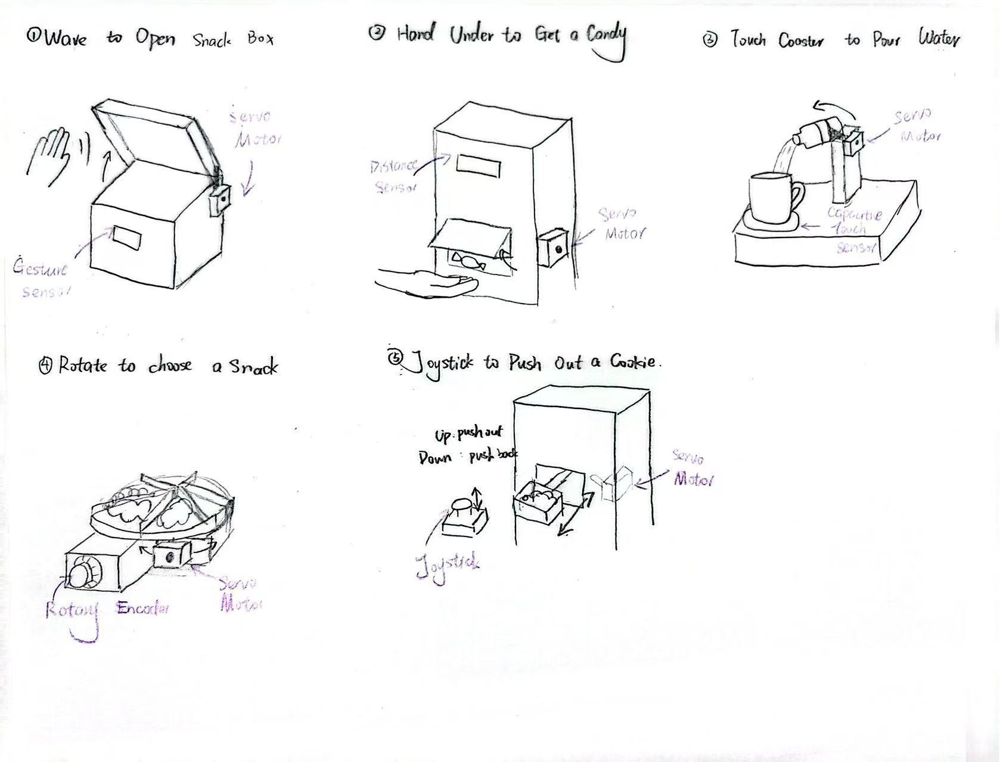

# Ph-UI!!!

<details>
	<summary><strong>Instructions for Students (Click to Expand)</strong></summary>
  
	**Submission Cleanup Reminder:**
	- This README.md contains extra instructional text for guidance.
	- Before submitting, remove all instructional text and example prompts from this file.
	- You may delete these sections or use the toggle/hide feature in VS Code to collapse them for a cleaner look.
	- Your final submission should be neat, focused on your own work, and easy to read for grading.
  
	This helps ensure your README.md is clear, professional, and uniquely yours!
</details>

---

## Lab Overview
Team: snack bots
Members: 
Wenqing Pan(wp273, Github: WenqingPan-Lucy ); 
Mandy Mao(mm3599, Github:manrongm)
Project name: Wave & Snack: A Gesture-Controlled Snack Box


For lab this week, we focus on both sensing and actuation, bringing new modes of input and output into your devices, while also prototyping the physical structure and overall look of the device. You will consider how the physical form supports sensing and actuation, and how these elements come together to shape the interaction and aesthetics of the device.


### Part D

**\*\*\*Draw 5 sketches that explore different physical arrangements for your sensing and actuation.\*\*\***




### Sketch 1: Wave to Open a Snack Box

This design allows users to open a snack box by waving their hands. A gesture sensor is placed on the front of the box to detect hand movements. A servo motor is attached to the side of the box to control the lid. When the user waves their hand, the servo rotates to open the lid, allowing them to grab a snack.

### Sketch 2: Hand-Activated Candy Dispenser

This design allows users to get candy without pressing any buttons. A distance sensor is placed near the bottom of the box to detect when a hand is underneath. A servo motor is installed inside the box to control a small gate. When a hand is detected, the servo opens the gate to release candy into the user's hand.

### Sketch 3: Touch-Activated Water Pourer

This design allows users to pour water by touching a coaster. Copper tape connected to a capacitive touch sensor is placed on the coaster. A servo motor is attached to a small container next to the cup. When the cup touches the copper tape, the servo tilts the container to pour water into the cup.

### Sketch 4: Rotary Snack Selector

This design allows users to choose snacks by turning a knob. A rotary encoder is placed on the front of the box, while a servo motor is installed underneath a circular platform holding different snacks. When the user turns the knob, the servo rotates the platform to bring the selected snack toward them.

### Sketch 5: Joystick-Controlled Snack Bowl

This design allows users to control a small snack bowl using a joystick. The joystick is placed outside the box, and a servo motor is installed inside to move the bowl through a sliding mechanism. When the user pushes the joystick upward, the bowl carrying a cookie moves out of the box. When the joystick is pulled downward, the bowl moves back inside.


**\*\*\*What questions do these sketches raise? What do you need to physically prototype to answer them?\*\*\***


### Questions Raised by the Sketches and Physical Prototyping Needs

**Sketch 1: Wave to Open a Snack Box**

- **Questions:** Can the gesture sensor reliably detect hand movements? Is the servo strong enough to open and close the box lid?
- **Physical Prototyping:** We need to test different sensor positions and build a cardboard lid to see whether the servo can open it smoothly.

**Sketch 2: Hand-Activated Candy Dispenser**

- **Questions:** Can the distance sensor accurately detect a hand underneath the box? How can we control the number of candies released?
- **Physical Prototyping:** We need to test the sensor's detection range and build a simple cardboard gate to see if candies can fall out without getting stuck.

**Sketch 3: Touch-Activated Water Pourer**

- **Questions:** Can the touch sensor reliably detect user input? Can the servo tilt the container at the right angle without spilling water?
- **Physical Prototyping:** We need to test the touch sensor with copper tape and build a cardboard support to test the tilting mechanism using an empty container first.

**Sketch 4: Rotary Snack Selector**

- **Questions:** Can the servo rotate the platform accurately to the selected snack? Can the platform support the weight of different snacks?
- **Physical Prototyping:** We need to build a cardboard rotating platform and test whether the servo can rotate it smoothly and stop at the correct positions.

**Sketch 5: Joystick-Controlled Snack Bowl**

- **Questions:** How can the servo's rotational movement be converted into the bowl's forward and backward movement? Will the bowl remain stable while moving?
- **Physical Prototyping:** We need to build a simple cardboard sliding mechanism and test whether the servo can move the bowl in and out without tipping it over.


**\*\*\*Pick one design to prototype and explain why.\*\*\***


### Selected Design: Wave to Open a Snack Box

We decided to prototype **Idea 1: Wave to Open a Snack Box** because it transforms a familiar dining experience into a more playful and interactive one. Instead of opening a snack box manually, users can simply wave their hands, making the interaction feel more engaging and fun.

We are also interested in exploring how touchless gestures can be used to interact with everyday objects. Additionally, the design has a relatively simple physical structure, allowing us to focus on testing the gesture sensor and the servo-controlled lid.

Through this prototype, we hope to explore how sensing and physical movement can make an ordinary activity more enjoyable.


**\*\*\*Document your rough prototype with photos and/or video.\*\*\***


### Prototype Documentation

We built a low-fidelity prototype of our gesture-controlled snack box using cardboard, a gesture sensor, and a servo motor.

The video below demonstrates our prototype and how the box responds to hand gestures.

**[Watch Our Prototype Video](https://drive.google.com/file/d/1WEn9dfrXIc-exooUZ6ztHu4NFcpg1fwo/view?usp=sharing)**

---

## Part 2

Following exploration and reflection from Part 1, complete the "looks like," "works like" and "acts like" prototypes for your design, reiterated below.

---

### Part E

#### Build & Integrate: Sensing + Actuation

For Part 2, build the Feast Automata interaction you developed in Part D by connecting sensing/input to physical actuation.

**Your prototype should:**
- Use at least one sensing or input device.
- Use servo-based physical actuation.
- Connect sensing and actuation into a meaningful interaction around eating, drinking, cooking, serving, or sharing food.
- Additional inputs, displays, LEDs, buttons, or other outputs are optional extensions.

**Document your system with:**
- Code for your sensing + actuation prototype
- Photos and/or video of the working prototype in action
- A simple interaction diagram or sketch showing how sensing and actuation are connected
- Written reflection: What did you learn about connecting sensing, movement, and physical form? What was fun, surprising, or challenging?

**Questions to consider:**
- How does your chosen sensor or input shape the physical response?
- How does the physical arrangement of the sensor and actuator change the interaction?
- What thresholds, timing, or movement patterns make the interaction feel clear or playful?
- What changes when you adjust the sensor placement or servo motion?

Iterate on the sensing, movement, and physical form, and document what you discover.

See encoder_accel_servo_dashboard.py in the Lab 4 folder for an optional example of chaining together three devices.

**`Lab 4/encoder_accel_servo_dashboard.py`**

#### Example Application: Windmill Coaster

Now that you have explored both sensing and actuation, here is a simple example that combines the two.

The **Windmill Coaster** uses a Qwiic distance/proximity sensor to detect when a cup is placed on a coaster. When the cup is detected, a servo motor animates a small windmill by sweeping it back and forth, turning an ordinary action during drinking into a playful physical interaction.

<p align="center">
    
</p>


This example demonstrates a simple interaction pipeline:

**cup placed → distance sensor detects cup → servo actuates windmill**

Connect the Qwiic distance sensor to the Pi and connect the servo to Channel 0 of the Servo pHAT. Make sure the Servo pHAT is powered through its USB-C connection.

Run the example script:

```bash
python windmill_coaster.py
```

The script continuously reads the proximity value from the distance sensor. When the value passes a threshold, the servo begins animating the windmill. When the cup is removed, the servo stops and returns to its resting position.

You may need to adjust `CUP_THRESHOLD` in [`windmill_coaster.py`](windmill_coaster.py) depending on the size of your cup and the physical placement of the sensor. You can run `qwiic_distance.py` first to compare readings with and without a cup.

Use this example as a starting point. Change the sensor, movement, physical form, or dining interaction to create your own Feast Automata variation.

#### Optional Extensions

The following examples are optional resources if you want to add more inputs or outputs to your prototype.

##### Using Multiple Qwiic Buttons: Changing I2C Address (Physically & Digitally)

If you want to use more than one Qwiic Button in your project, you must give each button a unique I2C address. There are two ways to do this:

##### 1. Physically: Soldering Address Jumpers

On the back of the Qwiic Button, you'll find four solder jumpers labeled A0, A1, A2, and A3. By bridging these with solder, you change the I2C address. Only one button on the chain can use the default address (0x6F).

**Address Table:**

| A3 | A2 | A1 | A0 | Address (hex) |
|----|----|----|----|---------------|
|  0 |  0 |  0 |  0 |    0x6F       |
|  0 |  0 |  0 |  1 |    0x6E       |
|  0 |  0 |  1 |  0 |    0x6D       |
|  0 |  0 |  1 |  1 |    0x6C       |
|  0 |  1 |  0 |  0 |    0x6B       |
|  0 |  1 |  0 |  1 |    0x6A       |
|  0 |  1 |  1 |  0 |    0x69       |
|  0 |  1 |  1 |  1 |    0x68       |
|  1 |  0 |  0 |  0 |    0x67       |
| ...| ...| ...| ... |     ...      |

For example, if you solder A0 closed (leave A1, A2, A3 open), the address becomes 0x6E.

**Soldering Tips:**
- Use a small amount of solder to bridge the pads for the jumper you want to close.
- Only one jumper needs to be closed for each address change (see table above).
- Power cycle the button after changing the jumper.

##### 2. Digitally: Using Software to Change Address

You can also change the address in software (temporarily or permanently) using the example script `qwiic_button_ex6_changeI2CAddress.py` in the Lab 4 folder. This is useful if you want to reassign addresses without soldering.

Run the script and follow the prompts:
```bash
python qwiic_button_ex6_changeI2CAddress.py
```
Enter the new address (e.g., 5B for 0x5B) when prompted. Power cycle the button after changing the address.

**Note:** The software method is less foolproof and you need to make sure to keep track of which button has which address!


##### Using Multiple Buttons in Code

After setting unique addresses, you can use multiple buttons in your script. See these example scripts in the Lab 4 folder:

- **`qwiic_1_button.py`**: Basic example for reading a single Qwiic Button (default address 0x6F). Run with:
	```bash
	python qwiic_1_button.py
	```

- **`qwiic_button_led_demo.py`**: Demonstrates using two Qwiic Buttons at different addresses (e.g., 0x6F and 0x6E) and controlling their LEDs. Button 1 toggles its own LED; Button 2 toggles both LEDs. Run with:
	```bash
	python qwiic_button_led_demo.py
	```

Here is a minimal code example for two buttons:
```python
import qwiic_button

# Default button (0x6F)
button1 = qwiic_button.QwiicButton()
# Button with A0 soldered (0x6E)
button2 = qwiic_button.QwiicButton(0x6E)

button1.begin()
button2.begin()

while True:
		if button1.is_button_pressed():
				print("Button 1 pressed!")
		if button2.is_button_pressed():
				print("Button 2 pressed!")
```

For more details, see the [Qwiic Button Hookup Guide](https://learn.sparkfun.com/tutorials/qwiic-button-hookup-guide/all#i2c-address).

---

##### PCF8574 GPIO Expander: Add More Pins Over I²C

Sometimes your Pi’s header GPIO pins are already full (e.g., with a display or HAT). That’s where an I²C GPIO expander comes in handy.

We use the Adafruit PCF8574 I²C GPIO Expander, which gives you 8 extra digital pins over I²C. It’s a great way to prototype with LEDs, buttons, or other components on the breadboard without worrying about pin conflicts—similar to how Arduino users often expand their pinouts when prototyping physical interactions.

**Why is this useful?**
- You only need two wires (I²C: SDA + SCL) to unlock 8 extra GPIOs.
- It integrates smoothly with CircuitPython and Blinka.
- It allows a clean prototyping workflow when the Pi’s 40-pin header is already occupied by displays, HATs, or sensors.
- Makes breadboard setups feel more like an Arduino-style prototyping environment where it’s easy to wire up interaction elements.

**Demo Script:** `Lab 4/gpio_expander.py`

<p align="center">
    
</p>

We connected 8 LEDs (through 220 Ω resistors) to the expander and ran a little light show. The script cycles through three patterns:
- Chase (one LED at a time, left to right)
- Knight Rider (back-and-forth sweep)
- Disco (random blink chaos)

Every few runs, the script swaps to the next pattern automatically:
```bash
python gpio_expander.py
```

This is a playful way to visualize how the expander works, but the same technique applies if you wanted to prototype buttons, switches, or other interaction elements. It’s a lightweight, flexible addition to your prototyping toolkit.

---


---

---

### Part F

### Final Documentation

Document all the prototypes and iterations you have designed and worked on! Again, deliverables for this lab are writings, sketches, photos, and videos that show what your prototype:
* "Looks like": shows how the device should look, feel, sit, weigh, etc.
* "Works like": shows what the device can do
* "Acts like": shows how a person would interact with the device

---

## Deliverables \& Submission for Lab 4

The deliverables for this lab are, writings, sketches, photos, and videos that show what your prototype:
* "Looks like": shows how the device should look, feel, sit, weigh, etc.
* "Works like": shows what the device can do.
* "Acts like": shows how a person would interact with the device.

For submission, the readme.md page for this lab should be edited to include the work you have done:
* Upload any materials that explain what you did, into your lab 4 repository, and link them in your lab 4 readme.md.
* Link your Lab 4 readme.md in your main Interactive-Lab-Hub readme.md. 
* Labs are due on Mondays, make sure to submit your Lab 4 readme.md to Canvas.
